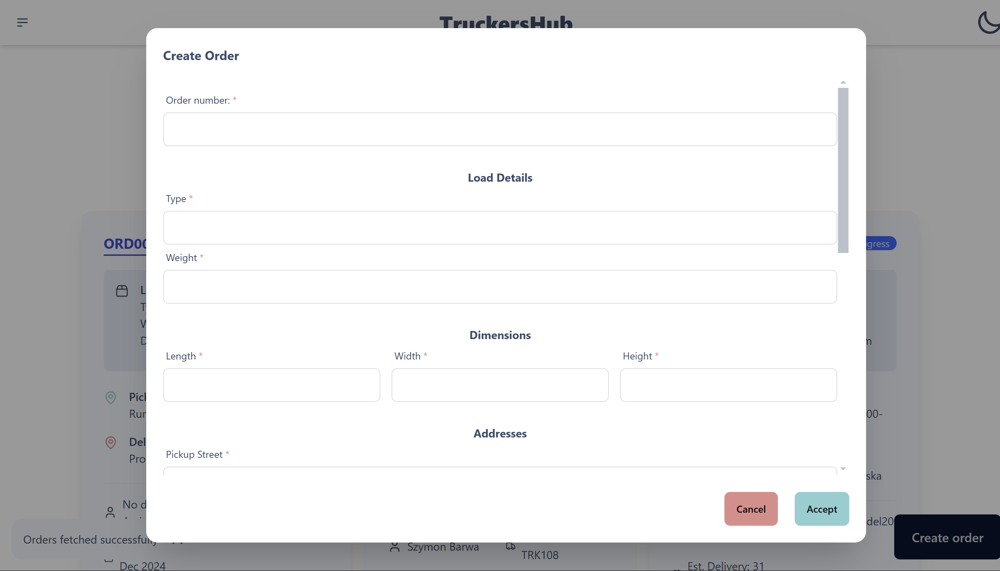

# **Wstęp**

## **Opis programu:**

Aplikacja trójwarstwowa dedykowana dla spedytorów i kierowców, wspierająca zarządzanie logistyką dostarczania przesyłek. System umożliwia rejestrację użytkowników, logowanie oraz zarządzanie zleceniami, kierowcami i ciężarówkami. Kluczowe funkcje obejmują dodawanie, edytowanie i usuwanie danych oraz przegląd statusów przesyłek.

## **Instrukcja uruchomienia projektu:**

### **Backend**


1. Stwórz bazę danych w MongoDB, zawierającą schemat zgodny z opisem w dokumentacji projektu.
2. Sklonuj repozytorium:  

```linux 
git clone https://github.com/hubertfus/TruckersHub-backend
```

3. Przejdź do katalogu projektu:  
```linux
cd TruckersHub-backend
```
4. Zainstaluj wymagane zależności:  
```linux
npm install
```
5. Skonfiguruj plik .env, zapewniając następujące zmienne:
```txt
CONNECTION_STRING: URL do bazy danych MongoDB.
Opcjonalnie: PORT na jakim ma działać serwer (domyślnie 3000).
```
6. Uruchom aplikację backendu:  
   npm start  
### **Frontend**
1. Sklonuj repozytorium frontendu:  
```linux
git clone https://github.com/hubertfus/TruckersHub-frontend
```   
2. Przejdź do katalogu projektu:  
```linux
cd TruckersHub-frontend
```
3. Zainstaluj wymagane zależności:
```linux
npm install
```
4. Skonfiguruj plik .env, zapewniając następujące zmienne:
```txt
VITE_API_ADDRESS: Adres i port serwera backendu (np. localhost:3000).
```
5. Uruchom aplikację frontendu:  
```linux
npm run dev
```
6. Otwórz przeglądarkę i przejdź do adresu wskazanego w konsoli (np. http://localhost:5173).


### **Technologie użyte w Backendzie:**

* `bcrypt`
* `body-parser`
* `cors`
* `dotenv`
* `express`
* `mongodb`
* `mongoose`
* `nodemon`

### **Technologie użyte w Frontendzie:**

* `axios`
* `leaflet`
* `lucide-react`
* `react`
* `react-dom`
* `react-leaflet`
* `react-router-dom`
* `tailwindcss`
* `daisyui`

## **Opis działań autorów projektu**

### Hubert Fusiarz:

* Koordynacja prac nad projektem.
* Projektowanie struktury bazy danych.
* Konfiguracja serwera bazy danych i backendu.
* Implementacja części walidatorów w dokumentach bazy danych.
* Opracowanie funkcji agregującej do pobierania zleceń.
* Realizacja działań niewyszczególnionych w tej dokumentacji.

### Maciej Pintal:

* Projektowanie diagramu ERD.
* Tworzenie responsywnych komponentów w React.
* Projektowanie i implementacja szablonów poszczególnych stron.
* Implementacja logowania i rejestracji po stronie frontendu.
* Konfiguracja użytkowników w bazie danych.
* Projektowanie widoku kierowców.
* Opracowanie funkcji agregującej do pobierania pojazdów.
* Realizacja logiki anulowania akceptacji zleceń, przypisywania kierowców i ciężarówek.

### Dawid Skiba:

* Implementacja logiki logowania i rejestracji.
* Tworzenie części walidatorów w dokumentach bazy danych.
* Projektowanie modeli w mongoose.
* Implementacja logiki autoryzacji zapytań użytkowników.
* Opracowanie funkcji agregującej do pobierania kierowców.
* Realizacja logiki edycji i akceptacji zleceń.

**Diagram Bazy danych**


## **Zdjęcia i opisy działania aplikacji**

Rejestracja:


Proces rejestracji konta: Wypełnianie formularza z danymi, tworzenie hasła i kliknięcie przycisku 'Register'. W łatwy sposób tworzysz nowe konto i dołączasz do platformy.

Logowanie:


Logowanie do konta: Wpisywanie adresu e-mail i hasła, a następnie kliknięcie przycisku 'Login'. Szybki dostęp do swojego konta na platformie.

Widok spedytora:


Widok spedytora: Panel z listą zamówień, zawierający szczegóły dotyczące kierowców i pojazdów przypisanych do każdego zlecenia. Możliwość monitorowania statusu zamówień, sprawdzania lokalizacji kierowców oraz przypisywania pojazdów do nowych tras.

Tworzenie nowego zamówienia:




Tworzenie nowego zamówienia: Wypełnianie formularza z danymi dotyczącymi przesyłki, wybór adresu nadania i odbioru, oraz przypisanie odpowiedniego pojazdu i kierowcy. Na końcu kliknięcie przycisku 'Accept', aby dodać zamówienie do systemu.

Oznaczanie zlecenia jako skończone:


Oznaczanie zamówienia jako skończone: Kliknięcie na zamówienie w systemie, zaznaczenie opcji 'Mark as Complete’, a następnie zapisanie zmian. Status zamówienia zmienia się na 'Completed', informując o zakończeniu realizacji.

Edycja zamówienia:


Otwarcie dialogu edycji, wprowadzenie zmian w danych (np. adresie nadania, odbioru lub w dacie), a następnie zapisanie zmian. Zaktualizowane informacje są natychmiastowo odzwierciedlone w systemie.

Usuwanie Zamówienia:


Usuwanie zamówienia: Kliknięcie na zamówienie, wybór opcji 'Delete Order' i potwierdzenie decyzji. Zamówienie zostaje trwale usunięte z systemu, a jego dane znikają z listy aktywnych zamówień.

Edycja kierowcy:


Otwarcie profilu kierowcy, wprowadzenie zmian w jego danych osobowych, numerze telefonu, przypisanych pojazdach lub dostępności. Na koniec kliknięcie 'Save', aby zaktualizować informacje w systemie.

Przypisywanie kierowcy do zamówienia bez kierowcy:


Wybór konkretnego zamówienia, kliknięcie opcji 'Assign to Order' lub ‘Assign driver’, a następnie wybór odpowiedniego kierowcy z listy spowoduje przypisanie kierowcy do zlecenia i zaktualizowanie statusu w systemie.

Usuwanie kierowcy:


Wybór przypisanego kierowcy w szczegółach zamówienia, kliknięcie opcji 'Delete'. Kierowca zostaje usunięty z zamówienia, a system automatycznie aktualizuje dane zlecenia.

Dodawanie Pojazdu:


Wypełnianie formularza z danymi pojazdu, takimi jak marka, model, numer rejestracyjny i inne szczegóły techniczne. Po kliknięciu 'save' nowy pojazd zostaje zapisany w systemie i dostępny do przypisania do zamówień.

Edycja pojazdu:


Wprowadzenie zmian w danych takich jak marka, model, numer rejestracyjny czy pojemność. Po kliknięciu 'Save' zmiany są natychmiastowo aktualizowane w systemie.

Usuwanie pojazdu:


Wybór pojazdu z listy, kliknięcie opcji 'Delete'. Pojazd zostaje trwale usunięty z systemu, a jego dane znikają z listy dostępnych pojazdów.


Widok kierowcy:


Akceptowania Zlecenia:


Kierowca przegląda szczegóły zamówienia na swoim panelu, kliknięcie przycisku 'Accept Order', aby potwierdzić przyjęcie zlecenia. System aktualizuje status zamówienia na 'in progress'

Anulowanie zlecenia:


kliknięcie opcji 'Cancel order’. Zamówienie zostaje anulowane, a jego status zmienia się na 'Cancelled' w systemie.

Szczegóły zamówienia:


Szczegóły kierowcy:


Szczegóły Cieżarówki:


## **Wybrane stworzone funkcje do obsługi bazy danych:

```javascript
router.get("/", async (req, res) => {
  try {
    const { driverId, role, createdAndWtihNoVehicleAssigned } = req.query;

    let matchConditions = {};

    if (role === "dispatcher") {
      if (createdAndWtihNoVehicleAssigned === "true") {
        matchConditions = { vehicle_id: null };
      } else {
        matchConditions = {};
      }
    } else {
      matchConditions = {
        $or: [
          { assigned_driver: new mongoose.Types.ObjectId(driverId) },
          { assigned_driver: null },
        ],
      };
      if (createdAndWtihNoVehicleAssigned === "true") {
        matchConditions.vehicle_id = null;
      }
    }

    const orders = await Order.aggregate([
      {
        $match: matchConditions,
      },
      {
        $lookup: {
          from: "users",
          localField: "assigned_driver",
          foreignField: "_id",
          as: "driver_details",
        },
      },
      {
        $lookup: {
          from: "vehicles",
          localField: "vehicle_id",
          foreignField: "_id",
          as: "vehicle_details",
        },
      },
      {
        $addFields: {
          driver_info: { $arrayElemAt: ["$driver_details.name", 0] },
          vehicle_info: {
            $cond: {
              if: { $gt: [{ $size: "$vehicle_details" }, 0] },
              then: {
                $concat: [
                  { $arrayElemAt: ["$vehicle_details.brand", 0] },
                  " ",
                  { $arrayElemAt: ["$vehicle_details.model", 0] },
                  " ",
                  { $arrayElemAt: ["$vehicle_details.license_plate", 0] },
                ],
              },
              else: "No Vehicle Assigned",
            },
          },
        },
      },
      {
        $sort: { created_at: -1 },
      },
      {
        $project: {
          driver_details: 0,
          vehicle_details: 0,
        },
      },
    ]);

    res
      .status(200)
      .json({ message: "Orders fetched successfully", data: orders });
  } catch (error) {
    console.error("Error in fetching orders:", error);
    res.status(500).json({ error: error.message });
  }
});
```

Funkcja ta obsługuje żądanie GET, które pobiera zamówienia z bazy danych na podstawie określonych warunków. W zależności od roli użytkownika (np. spedytor) i innych parametrów (np. brak przypisanego pojazdu), tworzy odpowiednie warunki filtrujące

```javascript
router.post(
  "/cancel",
  async (req, res, next) => {
    await validateAuthorization(req, res, next, "cancel");
  },
  async (req, res) => {
    const { userId, orderId } = req.body;

    if (!userId || !orderId) {
      return res.status(400).json({ message: "Missing userId or orderId" });
    }

    try {
      const order = await Order.findById(orderId);

      if (!order) {
        return res.status(404).json({ message: "Order not found" });
      }

      const updatedOrder = await Order.findByIdAndUpdate(
        orderId,
        { status: "cancelled" },
        { new: true }
      );

      res
        .status(200)
        .json({ message: "Order cancelled successfully", data: updatedOrder });
    } catch (error) {
      console.error("Error canceling order:", error);
      res.status(500).json({ message: "Internal server error" });
    }
  }
);
```

Funkcja ta obsługuje żądanie POST na endpoint `/cancel` i umożliwia anulowanie zamówienia. Składa się z dwóch głównych kroków:

1. **Walidacja autoryzacji**: Przed wykonaniem głównej logiki, funkcja wywołuje `validateAuthorization`, aby sprawdzić, czy użytkownik ma uprawnienia do anulowania zamówienia (przekazany parametr "cancel").
2. **Anulowanie zamówienia**:
    * Pobierane są dane z ciała żądania (`userId` i `orderId`).
    * Jeśli brakuje któregokolwiek z tych danych, zwracany jest błąd 400 z informacją o brakujących danych.
    * Następnie sprawdzane jest, czy zamówienie o podanym `orderId` istnieje w bazie.
    * Jeśli zamówienie jest znalezione, jego status jest aktualizowany na "cancelled", a wynik zwracany w odpowiedzi.
    * Jeśli wystąpi błąd w trakcie operacji, zwracany jest błąd 500 z komunikatem o problemie serwera.

   Na końcu zwrócone są odpowiednie informacje o sukcesie lub błędzie operacji.

```javascript
router.post(
  "/assign-driver",
  async (req, res, next) => {
    await validateAuthorization(req, res, next, "assign-driver");
  },
  async (req, res) => {
    const { orderId, driverId, dispatcherId } = req.body;

    if (!orderId || !driverId || !dispatcherId) {
      return res.status(400).json({
        message: "Missing required fields: orderId, driverId, dispatcherId",
      });
    }

    let session = null;

    try {
      if (
        mongoose.connection.readyState === 1 &&
        mongoose.connection.client.s.options.replicaSet
      ) {
        session = await mongoose.startSession();
        session.startTransaction();
      }

      const order = await Order.findById(orderId).session(session);
      if (!order) {
        throw new Error("Order not found");
      }

      const driver = await User.findById(driverId).session(session);
      if (!driver || driver.role !== "driver") {
        throw new Error("Driver not found or invalid role");
      }

      const dispatcher = await User.findById(dispatcherId).session(session);
      if (!dispatcher || dispatcher.role !== "dispatcher") {
        throw new Error("Dispatcher not found or invalid role");
      }
      let oldDriver;
      if (order.assigned_driver) {
        oldDriver = order.assigned_driver;
      }
      order.assigned_driver = driverId;
      order.status = "in_progress";

      const driverInfo = driver.name;

      await order.save({ session });

      await driver.save({ session });
      if (session) await session.commitTransaction();

      res.status(200).json({
        message: "Driver assigned successfully",
        order: {
          ...order.toObject(),
          driver_info: driverInfo,
        },
      });
    } catch (error) {
      if (session) await session.abortTransaction();
      console.error("Error assigning driver:", error);
      res.status(500).json({ message: error.message });
    } finally {
      if (session) session.endSession();
    }
  }
);
```

Ten kod obsługuje żądanie POST na endpoint /assign-driver, które pozwala na przypisanie kierowcy do zamówienia. Proces obejmuje następujące kroki:

1. **Walidacja autoryzacji**: Funkcja validateAuthorization sprawdza, czy użytkownik ma odpowiednie uprawnienia do przypisania kierowcy (przekazany parametr "assign-driver").
2. **Weryfikacja danych**: Sprawdzane są wymagane dane (orderId, driverId, dispatcherId). Jeśli któregokolwiek z tych danych brakuje, zwracany jest błąd 400\.
3. **Transakcja bazodanowa**: Jeśli połączenie z bazą jest aktywne i obsługuje replikację, rozpoczynana jest transakcja, aby operacje były atomowe:
    * Sprawdzenie istnienia zamówienia i kierowcy.
    * Sprawdzenie, czy użytkownik pełni odpowiednią rolę (kierowca i spedytor).
    * Przypisanie kierowcy do zamówienia oraz zmiana statusu zamówienia na "in\_progress".
    * Zapisanie zamówienia i użytkowników w bazie danych w ramach jednej transakcji.
4. **Zakończenie**: Jeśli wszystkie operacje przebiegły pomyślnie, transakcja jest zatwierdzana, a odpowiedź zawiera szczegóły przypisanego kierowcy. W przypadku błędu transakcja jest wycofywana, a użytkownik otrzymuje komunikat o błędzie.

Na końcu sesja bazy danych jest kończona.

### 

## **Podsumowanie:**

Projekt "TruckersHub" to kompleksowe rozwiązanie usprawniające zarządzanie logistyką w firmie transportowej. Aplikacja została zaprojektowana z wykorzystaniem nowoczesnych technologii, zapewniając wysoką wydajność oraz łatwość obsługi. Wprowadzono możliwość dynamicznego przełączania motywów (jasny/ciemny), co zwiększa komfort użytkowania. Nowoczesny design interfejsu zapewnia intuicyjną nawigację, a responsywność pozwala na wygodne korzystanie z aplikacji na różnych urządzeniach.

System umożliwia efektywne zarządzanie zleceniami, kierowcami i flotą pojazdów, zwiększając produktywność oraz kontrolę nad procesami logistycznymi. Dzięki elastyczności konfiguracji aplikacja może być łatwo zaadaptowana do specyficznych potrzeb przedsiębiorstw transportowych. Projekt stanowi solidną podstawę do dalszego rozwoju i implementacji dodatkowych funkcji w przyszłości.


